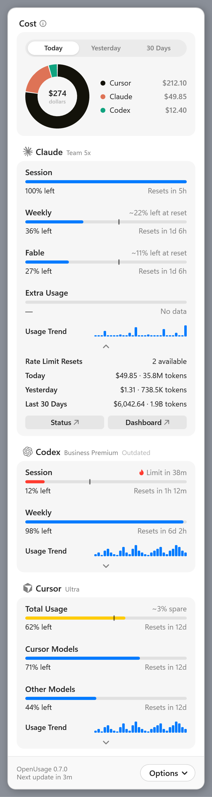
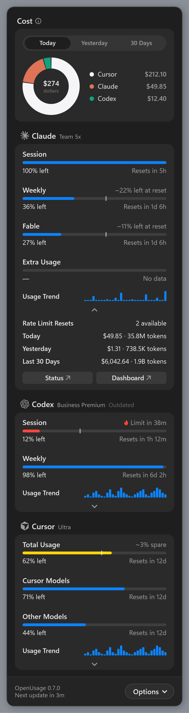
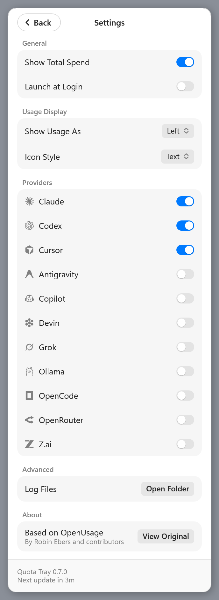

# Windows (Quota Tray)

> **Quota Tray** is the Windows app of [quota-tray](https://github.com/burguela/quota-tray),
> an unofficial fork of [OpenUsage](https://github.com/robinebers/openusage) by Robin Ebers and
> contributors. It is not an official OpenUsage release, and the original maintainers don't support it;
> report Windows problems in the fork's [issues](https://github.com/burguela/quota-tray/issues).

Quota Tray runs on Windows 10 and 11 as a notification-area (tray) app. It is built on OpenUsage's
engine, so it tracks the same providers, reads the same local credentials, and shows the same numbers as
the OpenUsage Mac app.

## Using it

The panel follows the Mac popover's layout and colors, in Windows' light or dark app mode.

- **Click the taskbar strip or the tray icon** to open the panel. It always opens in the same spot, right
  above the strip (above the notification area when the strip is off), even after you change the screen
  resolution or scale. Click anywhere else, or press Esc, to close it.
- **Cost** at the top is the Total Spend ring: what Claude, Codex, Cursor, and other spend-tracking
  providers cost Today, Yesterday, or over the last 30 days. Turn it off in Settings.
- Each provider has its own card with its meters, the plan, and a warning triangle when the last refresh
  failed (hover it for the reason). **The caret** under a card's rows reveals its On Demand rows and
  quick links. **Click a meter's reading** ("58% left") to switch every meter between Left and Used.
- **The footer** shows the version and the next automatic update; click "Next update in …" (or press
  F5 / Ctrl+R) to refresh every provider now.
- **Options** (bottom right) opens Settings, the log folder, and Quit. Settings has Show Total Spend,
  Launch at Login (on by default), Show Usage As (Left or Used), Icon Style (Text or Bars), a switch per
  provider, Open Folder for logs, and an About section that credits OpenUsage and links to the original
  project.
- **Right-click the tray icon** for Open Quota Tray, Refresh Now, Settings, Launch at Login, Open Log
  Folder, and Quit Quota Tray.

### In the taskbar

Like the OpenUsage Mac app's menu-bar strip, Quota Tray shows your pinned readings right in the
taskbar, just left of the notification area: each provider's mark followed by its values, with one value
as a single bold number and two stacked on two lines (for example Claude's Session and Weekly). Click
anywhere on the strip, including the gaps between readings, to open the panel, and right-click it for the
menu. It follows Show Usage As (Left or Used), and a
provider only appears once one of its pinned readings has data; until anything does, the strip shows
the Quota Tray icon.

The pinned readings are the Mac app's default stars (for example Claude Session and Weekly, Codex
Session and Weekly) for the providers you have turned on. **Icon Style** in Settings picks between this
strip (Text, the default) and Bars, which drops the strip and draws small meters in the Quota Tray tray
icon instead, as the Mac's Bars style does. The tray icon stays either way, in the notification area or
behind its `^` arrow, and hovering it lists every pinned reading. A taskbar docked to the left or right
side has no room for the strip, so there the tray icon shows the meters.

<p align="center">
  
  &nbsp;
  
</p>

<p align="center">
  
  &nbsp;
  
  &nbsp;
  
</p>

## Installing

Paste into PowerShell to install or update the latest
[release](https://github.com/burguela/quota-tray/releases/latest):

```powershell
irm https://github.com/burguela/quota-tray/releases/latest/download/install.ps1 | iex
```

It downloads the installer and runs it silently. Each release also has the files themselves:

- **`QuotaTray-Setup-x64.exe`** — the installer. It installs for your Windows account only, so it needs
  no administrator rights, into `%LOCALAPPDATA%\Programs\QuotaTray`. It adds Quota Tray to the Start
  menu, starts it when you sign in (checked by default), and can add a desktop shortcut. Run a newer
  installer to update; it closes a running copy first.
- **`QuotaTray-windows-x64.zip`** — the same app as a portable folder. Unzip it anywhere and run
  `QuotaTray.exe`; to update, quit Quota Tray and replace the folder. Its first launch also turns on
  Launch at Login; switch it off in Settings if you'd rather start it yourself.

To uninstall, use **Settings → Apps**, or paste:

```powershell
# Settings and logs stay; set $env:QUOTATRAY_PURGE = 1 first to remove them too.
irm https://github.com/burguela/quota-tray/releases/latest/download/uninstall.ps1 | iex
```

A reinstall picks up your settings and caches where you left off. With a downloaded installer,
`$env:QUOTATRAY_SETUP = 'C:\path\QuotaTray-Setup-x64.exe'` makes `install.ps1` use it instead of
downloading. Every successful run of the
[Windows workflow](https://github.com/burguela/quota-tray/actions/workflows/windows.yml) also offers
the same builds as the `QuotaTray-windows-setup` and `QuotaTray-windows-x64` artifacts.

Quota Tray isn't code-signed yet, so SmartScreen may warn the first time; choose **More info → Run
anyway**. It doesn't update itself; run the install command again for a new version.

## First run and refreshing

- On first launch, Quota Tray turns on the providers whose credentials it finds on the PC (falling back to
  Claude, Codex, and Cursor when it finds none), the same rule the OpenUsage Mac app uses.
- It shows cached values right away, then refreshes anything older than five minutes. While the panel is
  open it re-checks every minute, so reset countdowns stay current; while it's closed, every five minutes.
- A provider that fails keeps its last good values and shows the error above its rows.

## Where credentials come from

Each provider reads what its own CLI or desktop app already stored, exactly as on the Mac. On Windows:

| Provider | Looks in |
| --- | --- |
| Claude | `%USERPROFILE%\.claude\.credentials.json`; Claude Desktop in `%APPDATA%\Claude` (decrypted with the Windows account's DPAPI key) |
| Codex | `%USERPROFILE%\.codex\auth.json` (or `CODEX_HOME`) |
| Cursor | `%APPDATA%\Cursor\User\globalStorage\state.vscdb` |
| Devin | `%APPDATA%\Devin\User\globalStorage\state.vscdb` |
| Copilot | `%LOCALAPPDATA%\github-copilot\apps.json`, then `%APPDATA%\GitHub CLI\hosts.yml`, then Windows Credential Manager (`gh:github.com`) |
| Antigravity | the running Antigravity language server, found with PowerShell |
| Others | the same files and environment variables their provider pages list, under `%USERPROFILE%` |

The Mac Keychain maps to **Windows Credential Manager** (generic credentials). Most CLIs keep file-based
credentials on Windows, so Credential Manager is only a fallback.

## Where Quota Tray keeps its files

| What | Where |
| --- | --- |
| Settings and cached snapshots (provider on/off, meter style) | the `io.github.burguela.quotatray` preferences file Foundation's `UserDefaults` keeps under your user's AppData folder |
| Logs | `%LOCALAPPDATA%\QuotaTray\Logs\` (`Engine.log` from the engine, `QuotaTray.log` from the tray app) |
| Spend-history parse cache, pricing cache | `%LOCALAPPDATA%\QuotaTray\` |
| Launch at Login | `HKCU\Software\Microsoft\Windows\CurrentVersion\Run`, value `QuotaTray` |
| Show Total Spend, the selected spend period, Icon Style | `HKCU\Software\QuotaTray` |

Deleting that preferences file resets Quota Tray to a first run.

## What isn't on Windows yet

These OpenUsage Mac features are not part of Quota Tray: Customize (reordering, hiding, and pinning metrics;
Windows uses the default layout and its default pins), notifications, the global shortcut, the local HTTP API, iCloud Sync,
share cards, the Cost/MTok and Tokens views of Total Spend, and automatic updates. Install a new version by replacing the app folder.

## How it's built

Two programs ship side by side in one folder:

- `quotatray-engine.exe`: OpenUsage's shared Swift engine (the `OpenUsageCLI` target, built as
  `openusage-cli.exe` and renamed when packaged). It still works as the [command-line interface](cli.md),
  and it adds the desktop commands the tray app calls.
- `QuotaTray.exe`: the tray app, a small .NET 8 WPF program in `windows/QuotaTray/`. It runs the
  engine, reads the `openusage.desktop.v1` JSON it prints, and draws it. It never reads credentials or
  calls provider APIs itself.

The folder also holds the Swift runtime DLLs, the engine's resources (`OpenUsage_OpenUsage.resources`),
and `sqlite3.exe`, which Cursor, Devin, OpenCode, and Claude Desktop need to read their local databases.

The `Windows` GitHub Actions workflow (`.github/workflows/windows.yml`) builds everything on
`windows-latest`, uploads the folder as the `QuotaTray-windows-x64` artifact, then builds the installer
from that folder with [Inno Setup](https://jrsoftware.org/isinfo.php) (`windows/installer/QuotaTray.iss`),
checks that it installs and uninstalls cleanly through `install.ps1` and `uninstall.ps1`, and uploads it
as `QuotaTray-windows-setup`. To build
locally:

```powershell
# Swift 6.2 for Windows and the .NET 8 SDK installed. The -D flags let Swift 6.2's Clang use a newer
# Visual Studio C++ library; drop them if your Visual Studio matches the toolchain.
swift build -c release --product openusage-cli -Xcc -D_ALLOW_COMPILER_AND_STL_VERSION_MISMATCH -Xcxx -D_ALLOW_COMPILER_AND_STL_VERSION_MISMATCH
dotnet publish windows/QuotaTray/QuotaTray.csproj -c Release -r win-x64 --self-contained true -p:PublishSingleFile=true -o dist/QuotaTray
windows/scripts/package.ps1 -BuildDir .build/release -OutDir dist/QuotaTray
dist/QuotaTray/QuotaTray.exe
# Optional: the installer (Inno Setup 6). The version is the one the engine reports.
iscc /DAppVersion=0.7.0 /DAppDir=$PWD\dist\QuotaTray /DOutputDir=$PWD\dist\installer windows\installer\QuotaTray.iss
```

### Releasing

Quota Tray has its own version, `Version` in `windows/QuotaTray/QuotaTray.csproj`; the panel footer and the
installer show it. Only the owner picks a new number. To publish it, run the **Windows** workflow by hand
on `main` (Actions → Windows → Run workflow) with **Publish release** checked. After the app, the
installer check, and every test job pass, it creates the GitHub release `quotatray-v<version>` as Latest
with the installer, the portable zip, `install.ps1`, `uninstall.ps1`, and the notes in
`windows/installer/release-notes.md`. The notes open with what changed since the previous Quota Tray
release: the pull requests merged since then, as GitHub lists them, and a link to the full comparison.
It refuses a version that is already released.

While developing the tray app, set `QUOTATRAY_ENGINE` to a built `openusage-cli.exe` to use an engine
from another folder. `QuotaTray.exe --render-preview <dashboard.json> <folder>` renders the panel (light and
dark: dashboard, Settings, and the taskbar strip) to PNGs from a saved dashboard document; CI does this with
`windows/QuotaTray/Preview/sample-dashboard.json` and uploads the `QuotaTray-windows-screenshots`
artifact. `windows/scripts/generate_assets.py` regenerates the tray app's icon (Quota Tray's own
two-meter icon; the OpenUsage logo is the original project's trademark and isn't used) and provider
marks from `Sources/OpenUsage/Resources/ProviderIcons`.
